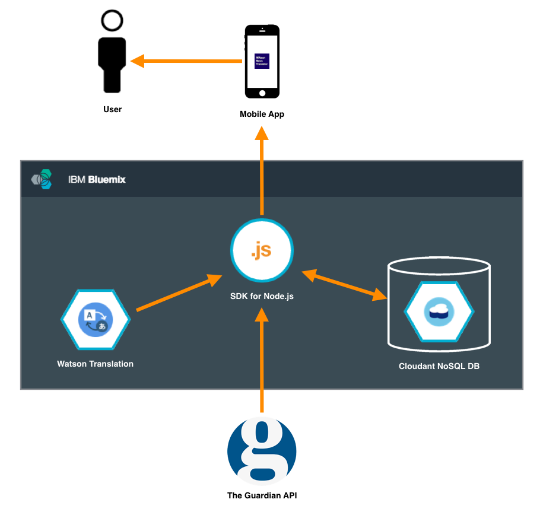

# WANT - WAtson News Translator

WANT is a demo solution to translate news **from English to Portuguese** using [IBM Watson Translation](http://www.ibm.com/smarterplanet/us/en/ibmwatson/developercloud/language-translation.html).

## Walkthrough

1. Run the app;
2. Select an article;
3. read the original article;
4. select **translated** and *voilà!*;
5. select **original** to go back to original text.

Simple as that! Do you not believe? See bellow!


## iOS App

* It was written in Objective C;
* It uses [MVVM](https://en.wikipedia.org/wiki/Model%E2%80%93view%E2%80%93viewmodel) as a software [architectural pattern](https://en.wikipedia.org/wiki/Architectural_pattern);
* It uses [AutoLayout](https://developer.apple.com/library/watchos/documentation/UserExperience/Conceptual/AutolayoutPG/Introduction/Introduction.html) for a responsive user interface;
* [Unit Tests](./frontend/WANT/WANTTests);
* [UI Tests](./frontend/WANT/WANTUITests);.

##### Dependencies (cocoapods)

* [Mantle](https://github.com/Mantle/Mantle);
* [SVProgressHUD](https://github.com/SVProgressHUD/SVProgressHUD);
* [VCRURLConnection](https://github.com/dstnbrkr/VCRURLConnection).

##### Support

The app was developed and tested with:

* XCode 7.1.1 and XCode 7.2.1;
* iOS 9 Simulator;
* OS X El Capitan 10.11.1;
* CocoaPods 0.39.0.

[You can take a look at iOS app code here](frontend).

## Backend

The iOS app connects to backend application that was built with [Node.js](https://nodejs.org) and is hosted on [Bluemix](http://www.ibm.com/cloud-computing/bluemix/) and rely on:

* Watson Translation services for translation;
* [Cloudant NoSQL DB](https://cloudant.com/) services for caching;
* [The Guardian APIs](http://open-platform.theguardian.com/) for news content.

##### Dependencies

* [Express](http://expressjs.com/);
* [Body Parser](https://github.com/expressjs/body-parser);
* [HTML to text](https://github.com/werk85/node-html-to-text);
* [Request](https://github.com/request/request#readme);

[You can take a look at server code here](backend).

## Architecture Diagram




## Dev Settings

##### Do you WANT to run with stubs? 

In [```AppSetup.m```](./frontend/WANT/WANT/Setup/AppSetup.m) change

```objective-c
[self useStubs:NO];
```

to 

```objective-c
[self useStubs:YES];
```

## TODO

- Improve HTML to plain text parser;
- Support to other languages;
- Local caching.
